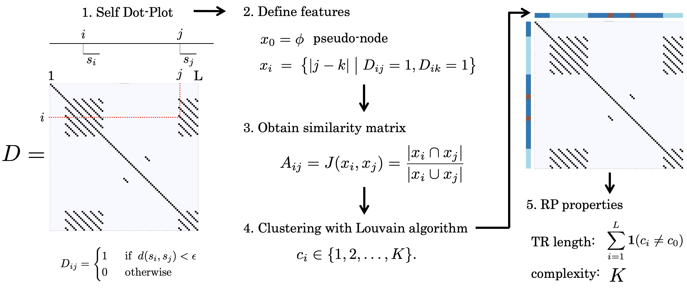
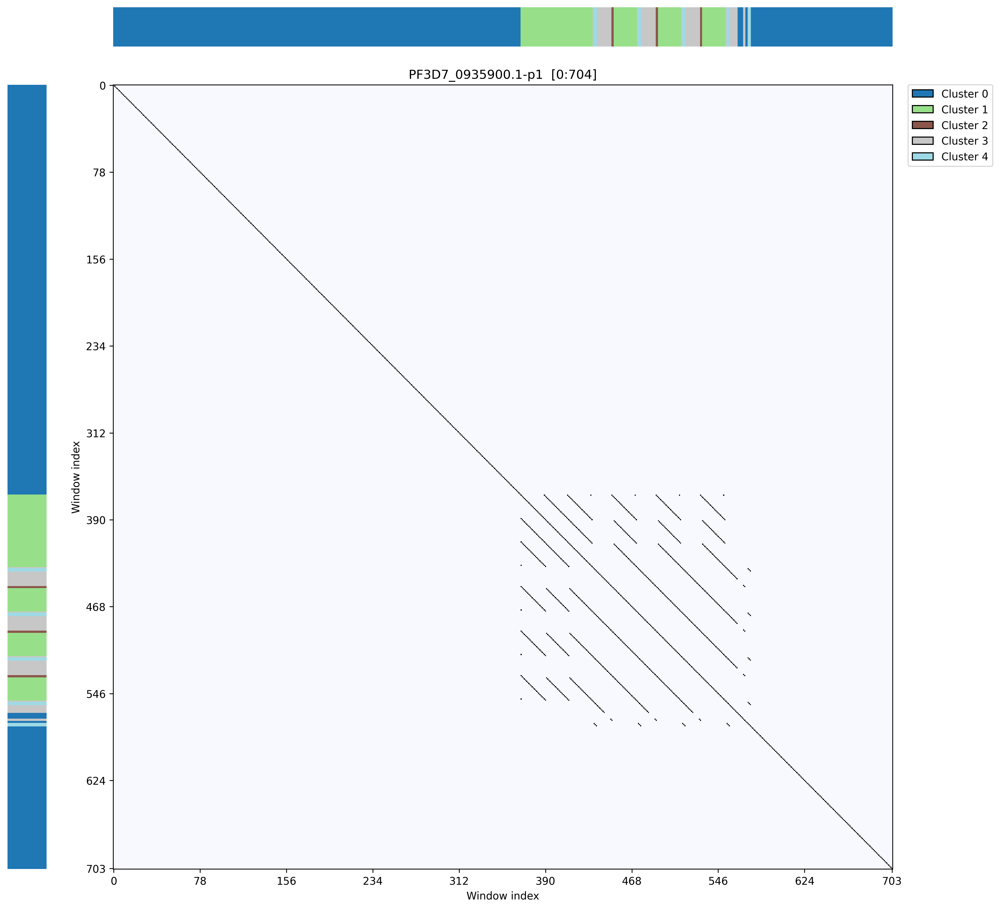
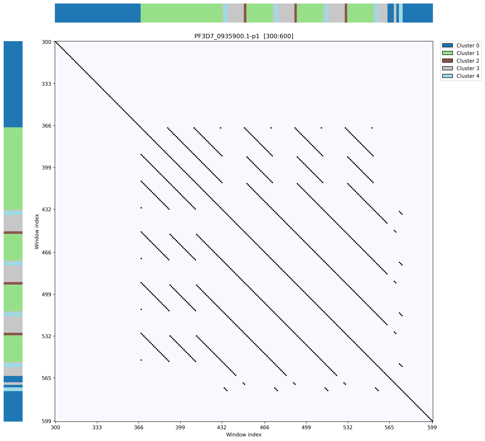
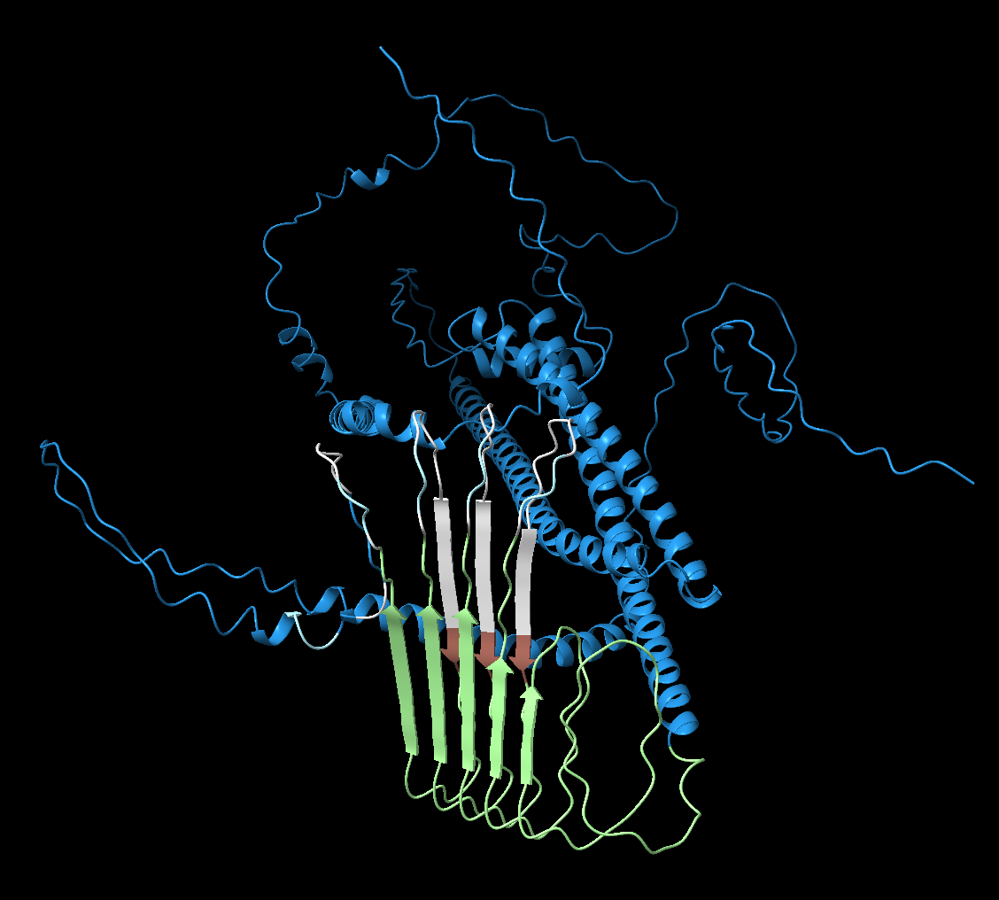

# Drepper
Dot plot–based framework for repetitive sequence profiling

<p align="center">
  
</p>

## Reference

## Requirements
Drepper is written with python.

### Required Python packages
- **numpy** — numerical computations
- **pandas** — tabular data handling
- **biopython** — FASTA sequence parsing (`Bio.SeqIO`)
- **rapidfuzz** — efficient Levenshtein distance computation
- **networkx** — graph construction and analysis
- **python-louvain** — Louvain community detection (`community_louvain`)

## Usage
```
python Drepper.py input.fasta output.tsv
```

## Input File
Protein or nucleotide sequences in standard FASTA format.

## Output File
The tool produces a tab-separated values (TSV) file, in which **each row corresponds to one input sequence**.

### Output TSV format

| Column | Name | Description |
|------|------|-------------|
| 1 | `sequence_id` | Sequence identifier (FASTA header) |
| 2 | `complexity` | Number of clusters (Complexity) |
| 3 | `pseudo_cluster` | Cluster ID of pseudo-node (expected to be 0) |
| 4 | `cluster_ids` | Comma-separated list of cluster IDs assigned to the sequence |


### Column details

- **`sequence_id`** 
  Identifier of the input sequence, taken directly from the FASTA header.

- **`complexity`**  
  Total number of clusters detected for the sequence.  
  This value represents the *Complexity* of the repeat structure.

- **`pseudo_cluster`**  
  Cluster ID of pseudo-nodes introduced during graph construction.  
  Under normal conditions, this value should be **0**.

- **`cluster_ids`**  
  A comma-separated string of cluster identifiers (e.g. `1,1,2,3,3,3`) representing the cluster assignment along the sequence.


## Example
```
python Drepper.py examples/example.fa examples/example.tsv
```

## Visualization (DotPlot)
You can visualize repeat architectures using `DotPlot.py`.
Use `--start` and `--end` to visualize a specific region of the sequence.

### Example

- **Full-length visualization**
```
python DotPlot.py examples/example.fa examples/example.tsv PF3D7_0935900.1-p1 fig/dotplot1.png
```

<p align="center">
  
</p>

- **Partial region visualization**
```
python DotPlot.py examples/example.fa examples/example.tsv PF3D7_0935900.1-p1 fig/dotplot2.png --start 300 --end 600
```
<p align="center">
  
</p>

## Visualization in ChimeraX
You can generate attribute and command files for visualization in ChimeraX using `make_chimerax_attr.py`.
This will color residues according to cluster assignments inferred by Drepper.

### Example
```
python make_chimerax_attr.py examples/example.tsv PF3D7_0935900.1-p1 examples/PF3D7_0935900.defattr examples/PF3D7_0935900.cxc
```

Run the following commands **in ChimeraX**:
```
open /path/to/Drepper/examples/AF-Q8I2G1-F1-model_v6.pdb
open /path/to/Drepper/examples/PF3D7_0935900.defattr
open /path/to/Drepper/examples/PF3D7_0935900.cxc
```

<p align="center">
  
</p>

### Data source

The example structure `AF-Q8I2G1-F1-model_v6.pdb` was obtained from the AlphaFold Protein Structure Database (UniProt: Q8I2G1).


## Tutorial including visualizing Dot plot
see example.ipynb

